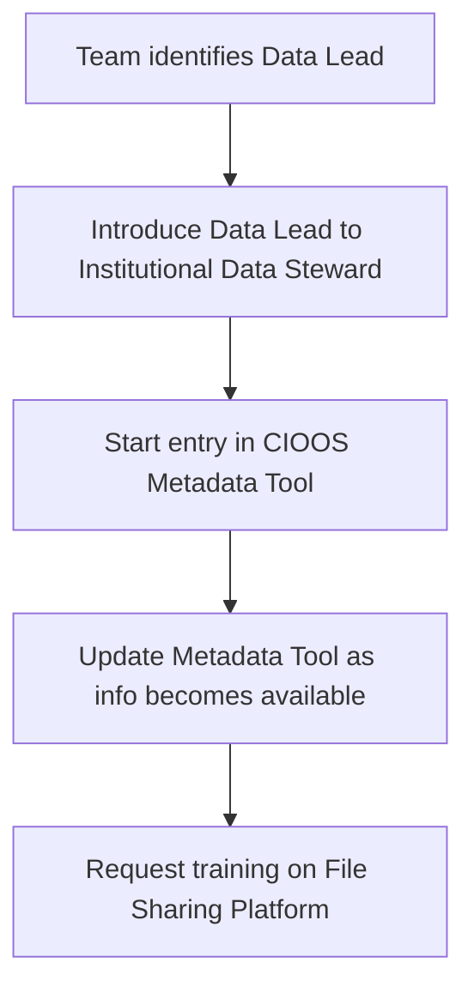
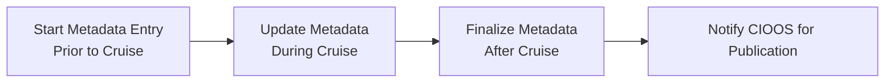
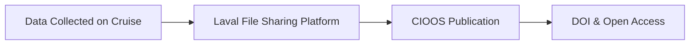

# Cluster 1.1

## Data Management Procedure for Cruise Data

### Prior to the Cruise

#### Overview

#### Step-by-Step Process

1. Identify who on your team will be responsible for the data from the cruise. For the remainder of this document this individual will be referred to as the "data lead"
   - !!! note
     Identifying a responsible individual ensures that someone will be accountable for the process and creates an opportunity for them to receive support from the TCA Data Management Accelerator.
2. Introduce the data lead to the data steward for your institution so the institutional data steward can support your work.
3. Prior to the start of the cruise the data lead should start an entry in the [CIOOS Metadata Entry Tool](https://cioos-siooc.github.io/metadata-entry-form/#/en/region-select)
   - !!! note
     Entries can be edited and updated at anytime. Starting an entry early makes it possible to capture information throughout the cruise preparation process. Working in this way is much easier than trying to remember key details after the completion of the cruise.
4. Add information to the entry in the [CIOOS Metadata Entry Tool](https://cioos-siooc.github.io/metadata-entry-form/#/en/region-select) as it becomes available through the process of preparing for the cruise.
5. Request training on how to submit data to the [File Sharing Platform Hosted at Laval University](../data-management-planning-guide/ulaval-file-sharing.md)
   - !!! note
     The [File Sharing Platform Hosted at Laval University](../data-management-planning-guide/ulaval-file-sharing.md) has been selected as the standard data storage solution for this cluster. This is intended as temporary storage, prior to submission to CIOOS.

### During the Cruise

1. Ensure that all key details relating to data collection are recorded as information becomes available. Capture everything you might need to make use of the data in the future.
   - !!! warning
     Trying to recall details after the fact is error prone

### After the Cruise

##### Metadata & Data FLow

1. Deposit all data into the [File Sharing Platform Hosted at Laval University](../data-management-planning-guide/ulaval-file-sharing.md). This provides a number of benefits:
   - Data are backed up, ensuring that data won't be lost due to equipment failure or human error
   - Data are easily shareable with other members of your team and other members of the cluster
   - Data from multiple research teams on-board the vessel can be centralized, making it easier to find and use
2. Complete the entry in the [CIOOS Metadata Entry Tool](https://cioos-siooc.github.io/metadata-entry-form/#/en/region-select)
3. Contact your local CIOOS regional association and notify them that your metadata entry is complete. Direct them to the copy in the[File Sharing Platform Hosted at Laval University](../data-management-planning-guide/ulaval-file-sharing.md) to begin the process of publishing the data through CIOOS. Publishing data through CIOOS provides several benefits: - CIOOS creates DOIs for your data so that it can be easily cited in publications. This is becoming a common requirement for publication in many scientific journals - Publishing data in an open data repository increases the visibility, reach, and potential impact of your work and may lead to new opportunities for collaboration - Contributing to the open data ecosystem benefits all ocean users - See the [CIOOS Data Management Resources page](https://cioos.ca/data-management-resources/) for additional information about the benefits of contributing data to CIOOS
   !!! note
   CIOOS has been selected as the standard data repository for cruise data in cluster 1.1
