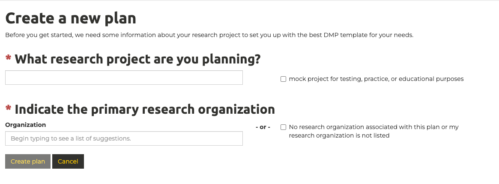

# Data Management Planning Guide
Data management plans (DMPs) are one of the foundations of good research data management (RDM), an international best practice, and increasingly required by institutions and funders, including the Canadian Tri-Agencies as outlined in their Research Data Management Policy. This page is intended to serve as a guide in helping you to prepare to draft a formal data management plan. 

The [Digital Research Alliance of Canada](https://alliancecan.ca/en) provides a free tool to support the creation of consistent, standardized research data management plans([DMP Assistant](https://dmp-pgd.ca/)). The [Canadian Integrated Ocean Observing System (CIOOS)](https://cioos.ca/) maintains a robust DMP template that we will be building on and expanding for the Transforming Climate Action (TCA) project.

A high-level overview of the data management planning process can be found here: [Data Management Plan Overview](data-management-plan-overview.md)

## 1. Accessing the DMP Assistant Tool
   
The DMP Assistant can be found here: [DMP Assistant](https://dmp-pgd.ca/). 

On the right side of the page you can either create an account, or sign-in using either your ORCID or your institutional login(all four institutions involved in the TCA program are supported).

Once logged in you should see the dashboard view, showing an overview of your previously created data management plans, as well as a view of other data management plans created at your organization:

This interface can be used to both create, and update, data management plans.

## 2. Creating a New Data Management Plan

Click "Create plan" in the dashboard view to begin the process.

This will bring you to a page requesting the title of your project and your primary research organization.

1. The title of your project can be any name you choose
2. In order to see the CIOOS DMP Template, you need to enter "Canadian Integrated Ocean Observing System" as your primary research organization. This choice doesn't have an impact other than dictating which DMP templates are available to you.
3. Select "CIOOS Data and Research Output Management Plan" as your DMP template:

You have now successfully started your data management plan!

## 3. Project Details