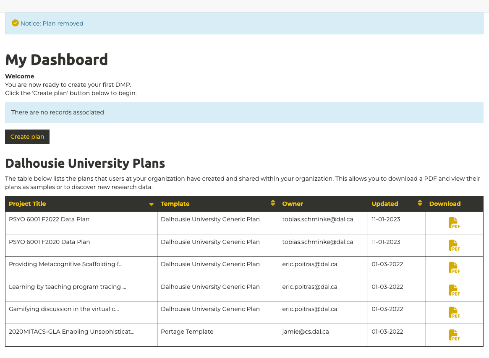
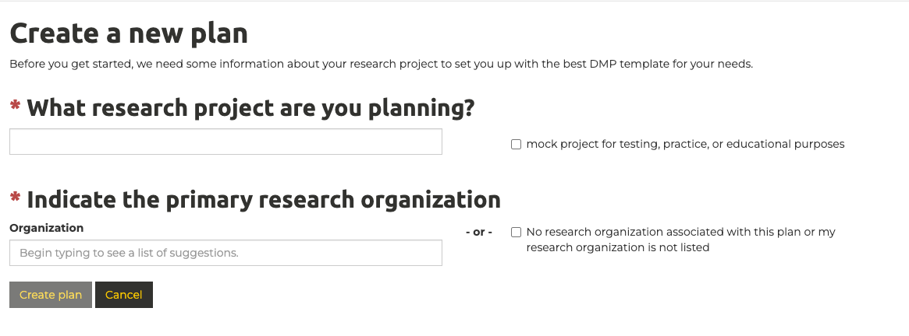
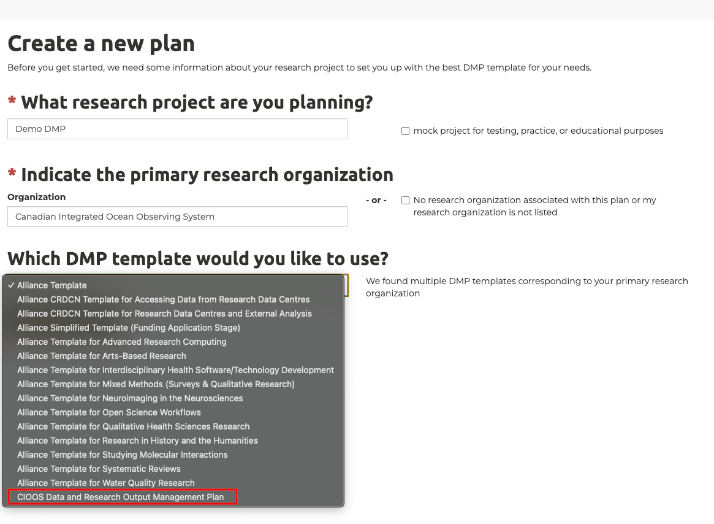
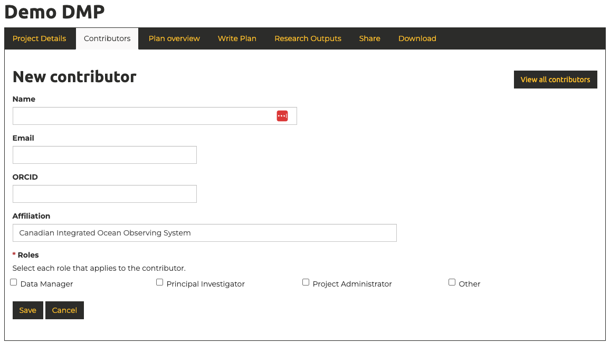

# How to Start a Data Management Plan
Data management plans (DMPs) are one of the foundations of good research data management (RDM), an international best practice, and increasingly required by institutions and funders, including the Canadian Tri-Agencies as outlined in their Research Data Management Policy. This page is intended to serve as a guide in helping you to prepare to draft a formal data management plan. 

The [Digital Research Alliance of Canada](https://alliancecan.ca/en) provides a free tool to support the creation of consistent, standardized research data management plans([DMP Assistant](https://dmp-pgd.ca/)). The [Canadian Integrated Ocean Observing System (CIOOS)](https://cioos.ca/) maintains a robust DMP template that we will be building on and expanding for the Transforming Climate Action (TCA) project.

## 1. Accessing the DMP Assistant Tool
   
The DMP Assistant can be found here: [DMP Assistant](https://dmp-pgd.ca/). 

On the right side of the page you can either create an account, or sign-in using either your ORCID or your institutional login(all four institutions involved in the TCA program are supported).

Once logged in you should see the dashboard view, showing an overview of your previously created data management plans, as well as a view of other data management plans created at your organization:

This interface can be used to both create, and update, data management plans.

## 2. Creating a New Data Management Plan

Click "Create plan" in the dashboard view to begin the process.

This will bring you to a page requesting the title of your project and your primary research organization.

1. The title of your project can be any name you choose
2. In order to see the CIOOS DMP Template, you need to enter "Canadian Integrated Ocean Observing System" as your primary research organization. This choice doesn't have an impact other than dictating which DMP templates are available to you.
3. Select "CIOOS Data and Research Output Management Plan" as your DMP template:

You have now successfully started your data management plan!

## 3. Overview of the Data Management Planning Interface

After starting a data management plan you will be sent to an interface that looks like this:

It is not a requirement that you complete your data management plan in one sitting. Your progress can be saved and you can revisit the interface as many times as needed. The data management plan can also be revisited and updated at any point throughout the project. Data management plans should be treated as living documents that are expanded and adjusted accordingly as research plans evolve.

The title of your project entered in [step 2](data-management-planning-guide.md#2-creating-a-new-data-management-plan) appears at the top of the page.

### Overview of the sections

The interface is organized into the following sections:

Section          | Description
---------------- | ------------- 
Project Details  | A high level overview of the project, including start an end dates, an absract, and information about the funding  
Contributors     | An overview of roles and responsibilities on the project, including the principal investigator, data management lead, project administrator, and any other key roles 
Plan overview    | An informational section providing a description of the key sections and an explanation of the purpose of a data management plan. Much of this information is echoed and expanded upon in [Data Management Plan Overview](data-management-plan-overview.md)
Write Plan       | This is where the plan itself is written. An overview of the sections is available in the plan overview section above as well as on the [Data Management Plan Overview](data-management-plan-overview.md)
Research Outputs | An overview of the specific outputs of the research. There are a variety of types of outputs including datasets and publications, but extending to include a broad swath of different output types
Share            | A section for inviting others to access and edit your data management plan
Download         | A section allowing the data management plan to be downloaded in a variety of formats

## 4. Project Details

This section documents high-level details about the project. Most fields are fairly self explanatory. At the bottom of the project details you will be some key details about the funding. Answers to these questions can be found in the table below:

Field               | Suggested Answer
------------------- | -------------------
Identifier          | Identifier isn't used, this can be left empty.
Funder              | Canada First Research Excellence Fund (CFREF)
Funding Status      | Funded
Grant number/url    | https://www.cfref-apogee.gc.ca/results-resultats/abstracts-resumes/competition_3/Dalhousie_University-eng.aspx

## 5. Contributors

This section of the data management plan is used to identify key personnel involved in the research effort. There is no limit to the number of contributors that can be added. At a minimum, the principal investigator, and the person within the research team who is responsible for looking after the data should be identified. The interface for adding collaborators looks as follows:

## Next Steps

Now that you've successfully completed the initial steps to initiate a data management plan, you're ready to move on to writing the core of the plan. The "Plan overview" tab provides a description of the types of information that you will be asked for when writing the plan.

When you're ready to begin writing the core of your data management plan click "Write Plan".

Onto the next step! [DMP Assistant - Write Plan Overview](1-write-plan-overview.md)