# DMP Asisstant - Write Plan Overview

This section in the DMP Assistant represents the core of your data management plan. There are a number of key considerations that can greatly strengthen your data management plan. Wherever possible, additional information and recommendations are provided for each of the sections described below.

If you haven't initiated your data management plan in the DMP Assistant yet, please see [Starting a Data Management Plan](0-starting-a-data-management-plan.md)

## Project Outputs

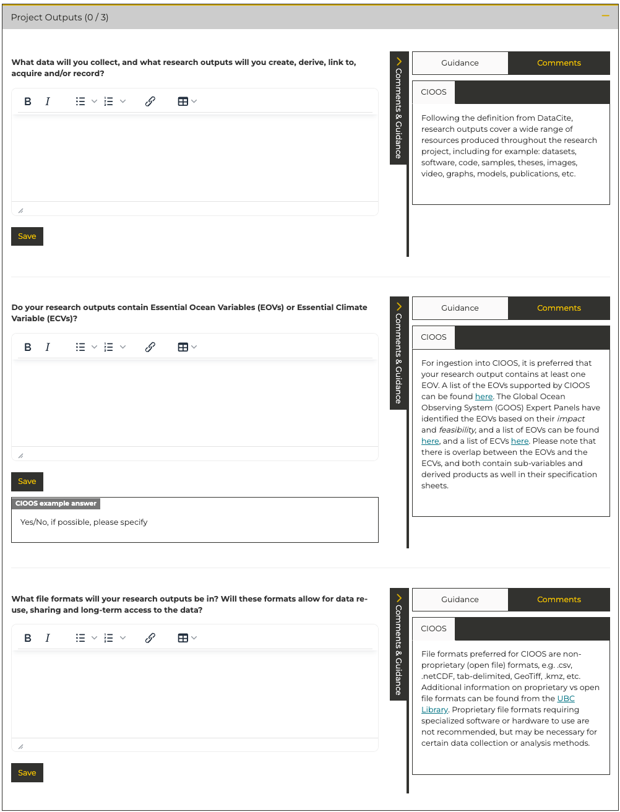

### What data will you collect, and what research outputs will you create?

The goal in this section of the data management plan is to identify the key outputs of this research. This includes: datasets, software, code, samples, theses, images, video, graphs, models, publications, and anything else you feel is relevant.

### Do your research outputs contain Essential Ocean Variables (EOVs) or Essential Climate Variable (ECVs)?

This section also asks about Essential Ocean Variables (EOVs) and Essential Climate Variables (ECVs). EOVs and ECVs are being used by the global ocean data management community to identify priority datatypes for global interoperability and availability in support of collaboration. CIOOS provides an overview of EOVs here: [Essential Ocean Variables](https://cioos.ca/essential-ocean-variables/). An overview of ECVs is available here: [Essential Climate Variables](https://gcos.wmo.int/site/global-climate-observing-system-gcos/essential-climate-variables)

### What file formats will your research outputs be in?

For recommendations and more information please see the [File Formats](2-file-formats.md) page.

## Documentation and Metadata

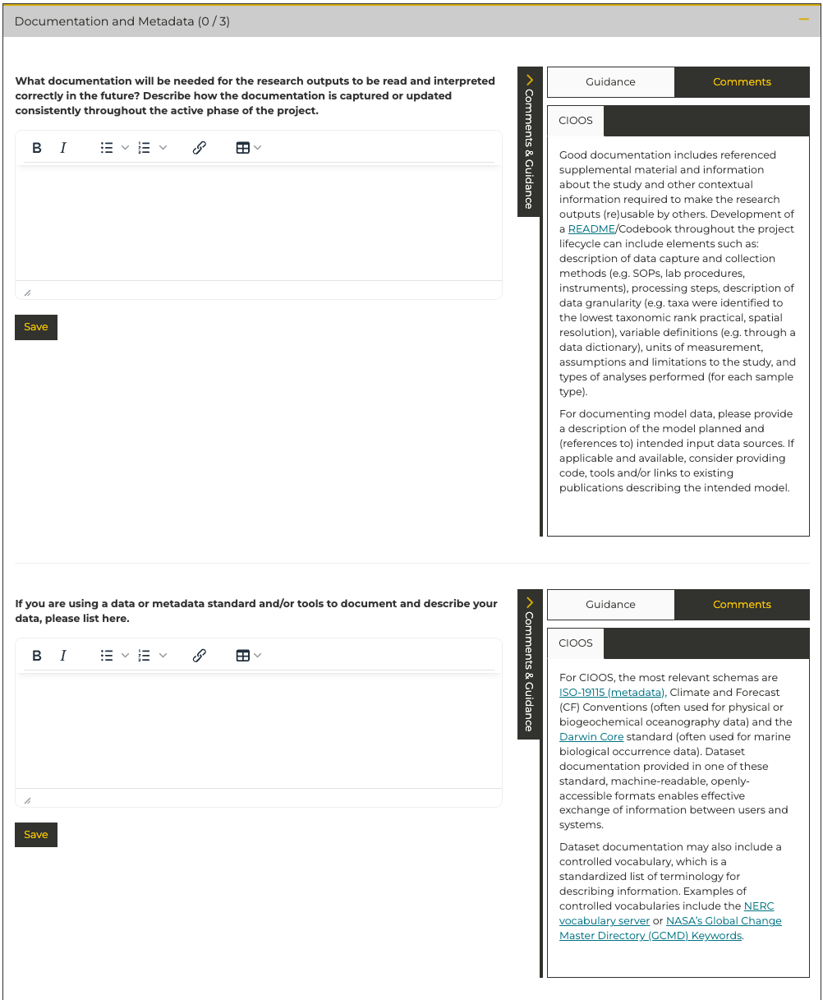
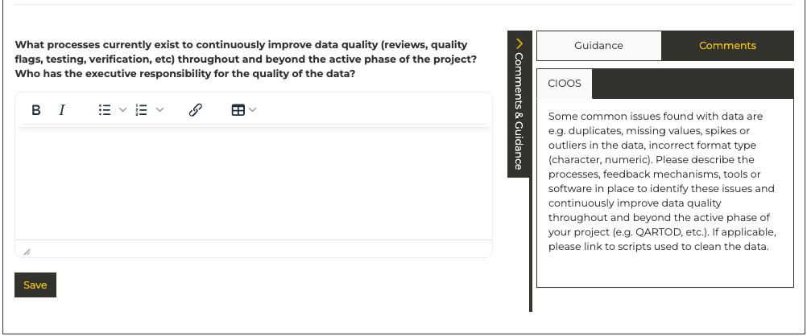

For recommendations and more information about choosing a metadata standard, please see the [Documentation and Metadata](3-documentation-and-metadata.md)

## Storage and Backup

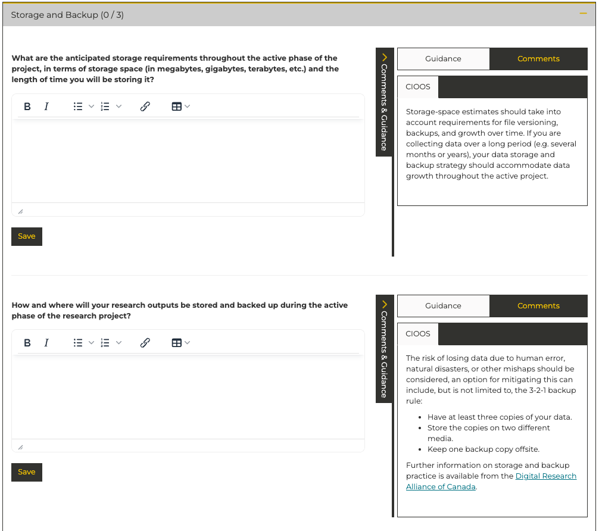
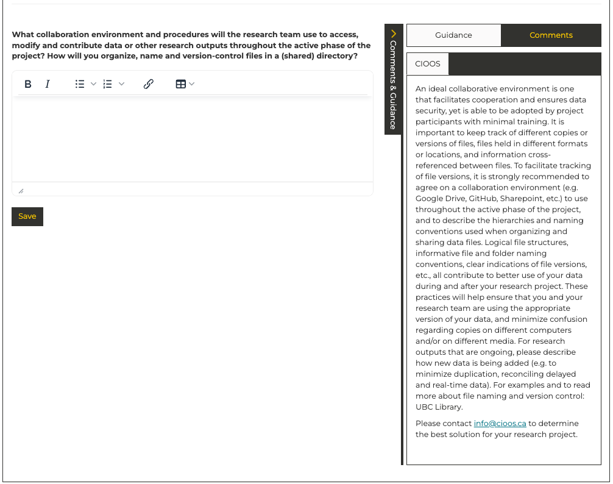

- What are the anticipated storage requirements throughout the active phase of the project, in terms of storage space (in megabytes, gigabytes, terabytes, etc.) and the length of time you will be storing it?
- How and where will your research outputs be stored and backed up during the active phase of the research project?
??? note
    If safe, secure, redundant near-term data storage represents a gap in your project, it is encouraged that you submit an [Application for the Canadian Digital Research Alliance Rapid Access Service.](https://docs.google.com/forms/d/e/1FAIpQLSeU_BoRk5cEz3AvVLf3e9yZJq-OvcFCQ-mg7p4AWXmUkd5rTw/viewform) For data storage requirements up to 10 terabytes applications are typically processed very quickly. [Additional details available here.](https://www.alliancecan.ca/en/services/advanced-research-computing/accessing-resources/rapid-access-service) If you have any questions please reach out to the data management accelerator at [insert address]
- What collaboration environment and procedures will the research team use to access, modify and contribute data or other research outputs throughout the active phase of the project? How will you organize, name and version-control files in a (shared) directory?
??? note
    If transfer of large data files represents a challenge in your project, the Canadian Digital Research Alliance offers a robust data transfer service for large data files. Combined with the Rapid Access Service documented above, this represents a robust approach to the transfer and storage of small to medium volumes of data. [Additional details available here.](https://docs.alliancecan.ca/wiki/Globus) If you have any questions please reach out to the data management accelerator at [insert address]

## Preservation

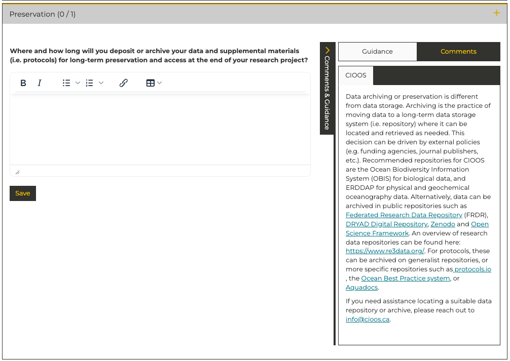

!!! note
    Data and metadata may be preserved through submission to a suitable open data repository. Please see the [Data Repository Documentation](data-repository-documentation/introduction.md) for further details.

## Sharing and Reuse

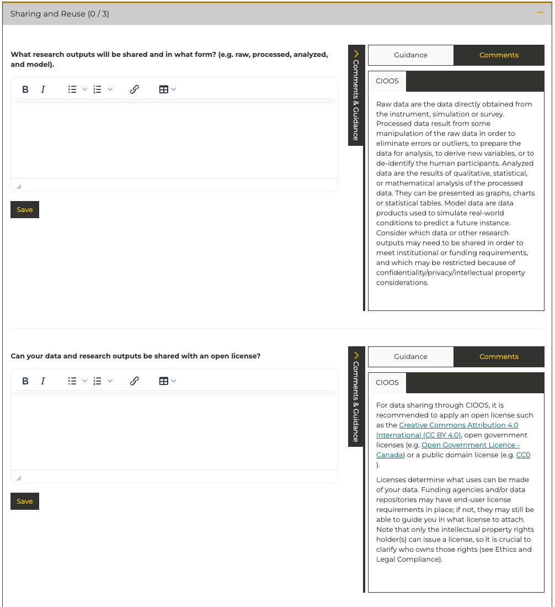
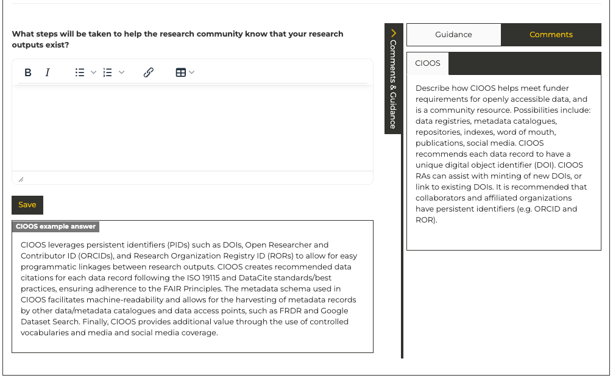

- What research outputs will be shared and in what form? (e.g. raw, processed, analyzed, and model).
- Can your data and research outputs be shared with an open license?
- What steps will be taken to help the research community know that your research outputs exist?
   
## Responsibilities and Resources

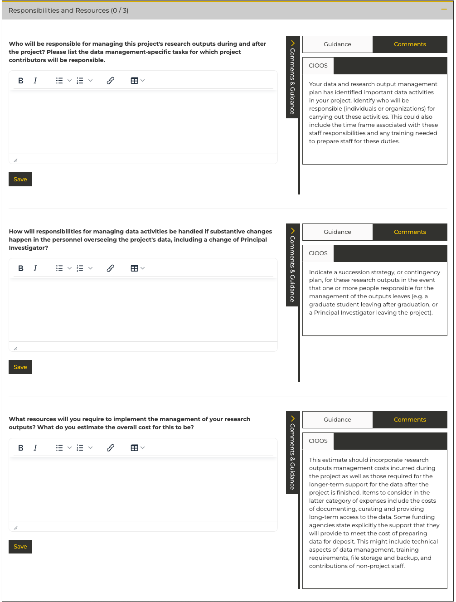

- Who will be responsible for managing this project's research outputs during and after the project? Please list the data management-specific tasks for which project contributors will be responsible.
- How will responsibilities for managing data activities be handled if substantive changes happen in the personnel overseeing the project's data, including a change of Principal Investigator?
!!! note
    The TCA Data Management Accelerator is here to support you throughout the data management process, but ultimate responsiblity for the dataset should remain within your team.
- What resources will you require to implement the management of your research outputs? What do you estimate the overall cost for this to be?

## Ethics and Legal Compliance

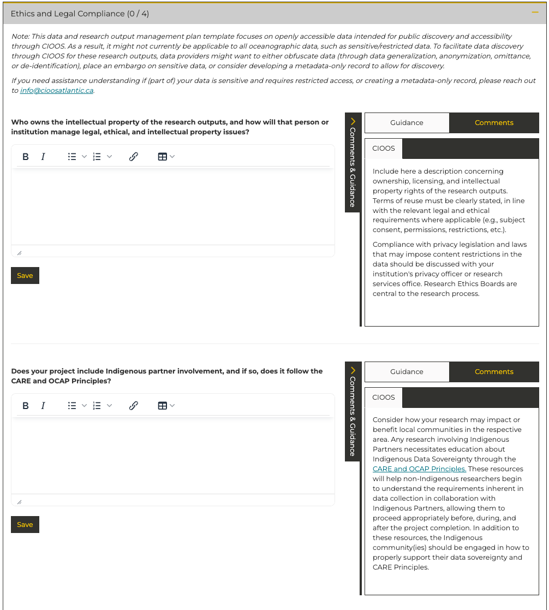
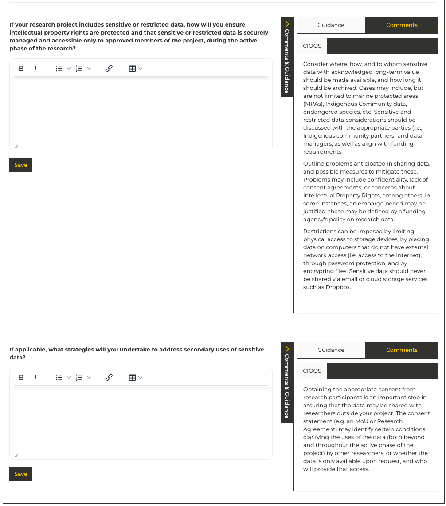

- Who owns the intellectual property of the research outputs, and how will that person or institution manage legal, ethical, and intellectual property issues?
- Does your project include Indigenous partner involvement, and if so, does it follow the CARE and OCAP Principles?
- If your research project includes sensitive or restricted data, how will you ensure intellectual property rights are protected and that sensitive or restricted data is securely managed and accessible only to approved members of the project, during the active phase of the research?
- If applicable, what strategies will you undertake to address secondary uses of sensitive data?

# Additional DMP Considerations for Sensitive Data
## Sharing and Reuse
- What data cleaning and anonymization procedures will be required to protect the confidentiality of partitipants in your research?

More detailed documentation is available through the [DMP Assistant website](https://dmp-pgd.ca/), which is built and maintained by the [Digital Research Alliance of Canada](https://alliancecan.ca/en).