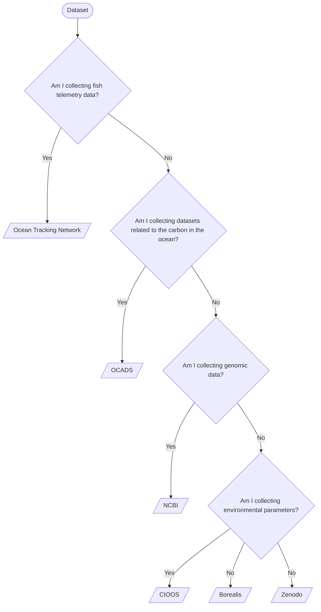

# Introduction

This section in the documentation is intended to give an overview of recommended data repositories for TCA data. The Data Management Accelerator has already engaged with each of these repositories and mapped out pathways for aggregating metadata for any TCA datasets that has been uploaded to these repositories.

There is a rich and diverse ecosystem of data repositories. Some are highly specialized, designed to collect a specific type of data for a particular purpose. Others are subject-specific, providing a centralized platform for discovering data related to a particular field of study. Finally, there are fully generalized repositories that accept data of any type, regardless of subject or format.

In general, the more specialized a repository is, the more tailored its tools, standards, documentation, and support will be for the data it accepts. Conversely, general-purpose repositories tend to offer broader, less customized support. When depositing data in a generalized repository, it's especially important to ensure that your submission is well-documented and formatted for future reuse. Because these repositories are designed to handle any type of data, they typically cannot provide best-practice guidance for every possible format or discipline.

## Repositories supported by the TCA Data Management Accelerator

Specialized repositories:

- NCBI
- OCADS
- OTN

Subject-specific repositories:

- CIOOS
  - The Saint Lawrence Global Observatory (SLGO)
  - CIOOS Atlantic

Generalist repositories:

- Borealis
- Zenodo

## Choosing a Repository

