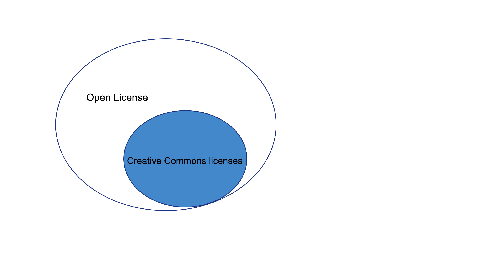

# Data License

## What are data licenses?

A data license is a legal document that specifies the standard set of terms and conditions regarding sharing and re-use of your data. - CIOOS

# Open License

You can choose an open licence to maintain your copyright while enabling the public to use and remix your creative work. An open licence grants permissions and states restrictions; 
Creative Commons (CC) licenses are a standardized, widely-used set of open licenses tailored to copyrightable works. 

### Creative Commons licenses

> Creative Commons licenses give everyone from individual creators to large institutions a standardized way to grant the public permission to use their creative work under copyright law. From the reuser’s perspective, the presence of a Creative Commons license on a copyrighted work answers the question, “What can I do with this?”
>
> Creative Commons offers a range of licenses and tools to help authors and creators share their work on flexible terms while maintaining certain rights. For more information, visit [creativecommons.org](https://creativecommons.org).

### How to select a License

Choosing an open license for your data is a key step in promoting transparency, reuse, and collaboration. To help you select the most appropriate license based on your goals and the nature of your data, you can use the [Creative Commons License Chooser](https://chooser-beta.creativecommons.org) tool.

## Open Licenses vs Creative Commons licenses

Creative Commons licenses are a standardized subset of open licenses that allow creators to share their work with clear terms, supporting reuse while retaining specific rights.

