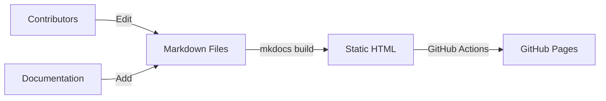

[](https://github.com/Transforming-Climate-Action/Transforming-Climate-Action.github.io/actions/workflows/ci.yml) [](https://github.com/Transforming-Climate-Action/Transforming-Climate-Action.github.io/actions/workflows/pages/pages-build-deployment)

# TCA Data Management Accelerator Documentation Hub

Welcome to the TCA Data Management Accelerator Documentation Hub!

The live version of this page can be found here: https://transforming-climate-action.github.io/

This project is intended as a starting point for TCA researchers to find relevant documentation and best practices for various data types, including guidance on repositories, and submission processes

## Installation

This website is intended to be built and deployed on a web server as a set of HTML files. It is built using a library called mkdocs

mkdocs installation instructions can be found here: https://www.mkdocs.org/getting-started/#installation

Once mkdocs has been installed, the site can be run in development mode using
`mkdocs serve`

To build a new version for deployment run `mkdocs build`. The generated HTML will be found in the `site/` directory

## Guide for contributors

The documentation hub can be expanded according to the official mkdocs documentation, found here: https://www.mkdocs.org/getting-started/#adding-pages

### Diagrams

Diagrams can be created using a variety of tools. The following are some options:

- Diagrams are created using Pencil: https://pencil.evolus.vn/. Note: when creating or modifying diagrams, both the Pencil `.epgz` file and the resulting image should be included in the repository, in the same location. This allows for future maintenance and updates.

- Another option is to use `mermaid.js`, which allows for diagrams to be created in markdown files. This is a good option for simple diagrams, but more complex diagrams may be better suited to Pencil. For example, the following notation will produce a simple flowchart:

````

````


